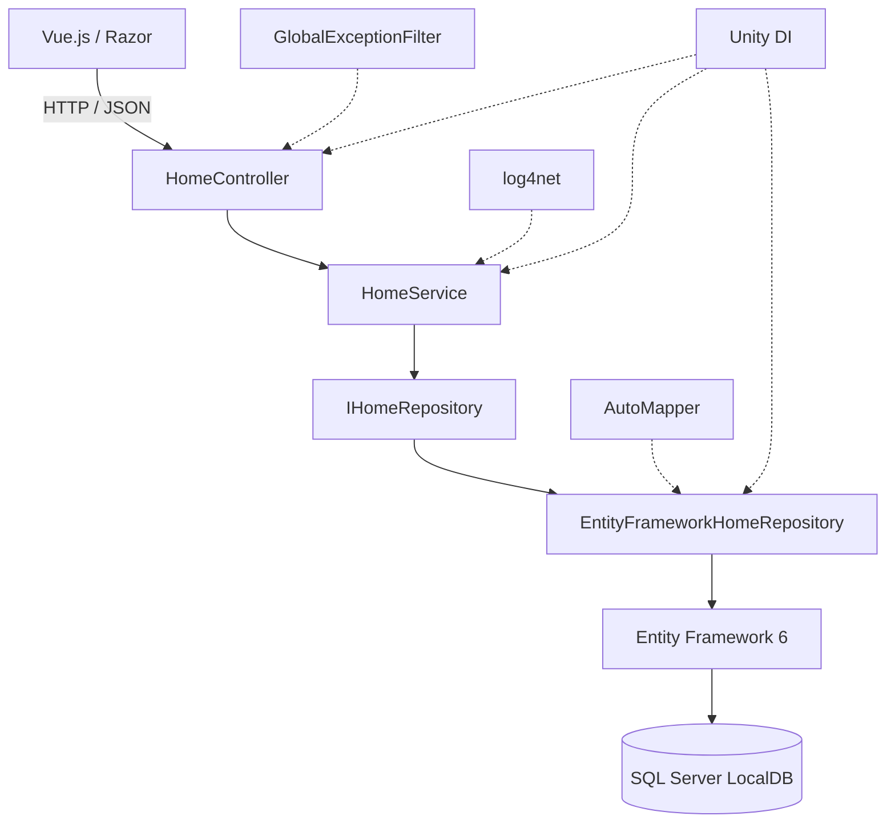
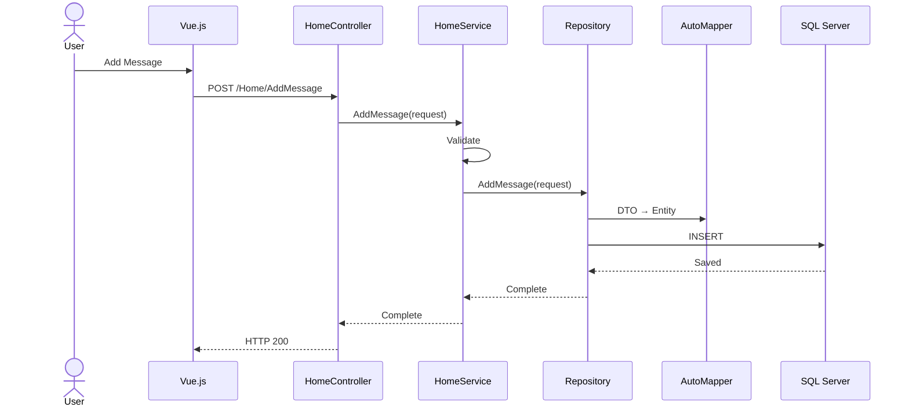
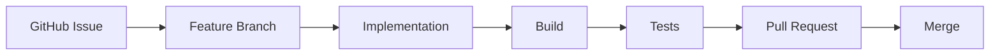

# 🚀 Dotnet Backend Study

[English](README.md) | **日本語**

> シンプルなASP.NET MVCのCRUDアプリケーションを、構造化された保守性の高いバックエンドシステムへ段階的に発展させる学習プロジェクトです。


**C#**、**ASP.NET MVC 5**、**.NET Framework 4.8**で構築したバックエンドエンジニアリングの学習リポジトリです。

単純なCRUDアプリケーションから出発し、バックエンドアーキテクチャ、永続化、依存関係管理、バリデーション、テスト、保守性を学ぶために段階的なリファクタリングを行っています。各改善を既存システムへ小さく導入することで、アーキテクチャへの影響をリポジトリ履歴から追えるようにしています。

---

## 🖥️ デモ

> 現在のアプリケーション：Vue.jsとASP.NET MVCによる、サーバーサイドページネーション対応の永続化Message CRUD。

フロントエンドはFetch APIを通じてASP.NET MVCと通信し、メッセージデータはEntity Framework 6とSQL Server LocalDBに保存されます。

---

## ✨ プロジェクト概要

| 区分 | 技術 |
|---|---|
| **言語** | C# |
| **フレームワーク** | ASP.NET MVC 5 · .NET Framework 4.8 |
| **アーキテクチャ** | Controller · Service · Repository |
| **データベース** | SQL Server LocalDB |
| **ORM** | Entity Framework 6 |
| **依存性注入** | Unity |
| **オブジェクトマッピング** | AutoMapper |
| **ロギング** | log4net |
| **フロントエンド** | Razor · Vue.js · Fetch API |
| **テスト** | MSTest |
| **開発フロー** | GitHub Issues · Feature Branches · Pull Requests |

---

## 🏗️ アーキテクチャ



レイヤーごとの責務を次のように分離しています。

| レイヤー | 責務 |
|---|---|
| **Controller** | HTTP境界、リクエスト／レスポンス処理 |
| **Service** | バリデーションとアプリケーションロジック |
| **Repository** | 永続化の抽象化とデータベースクエリ |
| **Entity Framework** | ORMとSQL Serverへのアクセス |

Serviceは具象のEntity Framework Repositoryではなく`IHomeRepository`に依存します。これにより、ビジネスロジックを永続化の詳細から切り離し、テストしやすくしています。

---

## 🔥 主な改善内容

| Before | After |
|---|---|
| Controllerにロジックが集中 | Controller → Service → Repository |
| インメモリデータ | Entity Framework + SQL Server LocalDB |
| 具象クラスへの直接依存 | Unityによる依存性注入 |
| Repositoryの具象実装に依存 | `IHomeRepository`による抽象化 |
| DTO／Entityを手動変換 | AutoMapper Profileへ集約 |
| 各所で重複する例外処理 | Global Exception Filter |
| 集約されたログがない | log4net |
| 手動確認のみ | MSTestによる単体テスト |
| スキーマ変更履歴がない | EF Code First Migrations |
| 全レコードを一括取得 | `Skip`／`Take`によるサーバーサイドページネーション |

目的は機能を増やすことだけではなく、**関心の分離、テスト容易性、保守性、拡張性**を段階的に改善することです。

### パフォーマンス改善事例

- [TIFFからPDFへの変換処理：技術検証からパフォーマンス改善まで](https://github.com/lemonwasp/tiff-to-pdf-performance-case-study/blob/main/README.ja.md)  
  テストデータ生成、ライブラリ選定、一時ファイルによるディスクI/Oの除去、`MemoryStream`を利用したインメモリ処理、Streamのライフサイクル管理までを別リポジトリのケーススタディとして整理しています。

---

## 📈 アーキテクチャの発展

```mermaid
flowchart LR
    A["Basic MVC CRUD"]
    --> B["Service Layer"]
    --> C["Repository"]
    --> D["Dependency Injection"]
    --> E["Unit Testing"]
    --> F["Logging"]
    --> G["Validation"]
    --> H["Entity Framework"]
    --> I["Migrations"]
    --> J["Global Exception Handling"]
    --> K["AutoMapper"]
    --> L["Pagination"]
    --> M["Search / Filtering"]

    style K fill:#d1fae5
    style L fill:#d1fae5
    style M fill:#fef3c7
```



**現在：** サーバーサイドページネーションまで完了  
**次：** 検索／フィルタリング

---

# 🛠️ 技術詳細

## 💉 依存性注入

Unityが次の依存関係を解決します。

```text
HomeController
     ↓
HomeService
     ↓
IHomeRepository
     ↓
EntityFrameworkHomeRepository
     ↓
ApplicationDbContext
```

結合度を下げ、実データベースを使わずにServiceの振る舞いをテストできます。

## 🗄️ 永続化

**Entity Framework 6**と**SQL Server LocalDB**を使用します。

| コンポーネント | 責務 |
|---|---|
| `ApplicationDbContext` | Entity FrameworkのDBコンテキスト |
| `DbSet<Message>` | Messageの永続化 |
| LINQ | データベースクエリ |
| Code First | Entityからのスキーマ生成 |
| EF Migrations | スキーマのバージョン管理 |
| SQL Server LocalDB | ローカル開発用データベース |

データベースを手作業で再作成せず、Entity Framework Migrationでスキーマ変更を管理します。

## 🔄 DTO／Entityマッピング

永続化Entityとリクエスト／レスポンスモデルを分離し、AutoMapperで変換を集約しています。

```text
CreateMessageRequest → Message
UpdateMessageRequest → Message
Message              → MessageResponse
```

Repositoryメソッドからマッピング処理を切り離し、重複したプロパティ代入を防ぎます。

## 📄 サーバーサイドページネーション

テーブル全体をメモリへ読み込まず、サーバー側でMessage取得範囲を制限します。

```text
Clientがpage + pageSizeを送信
          ↓
Controllerが入力境界を検証
          ↓
Serviceがクエリを委譲
          ↓
Repositoryが対象件数を集計
          ↓
OrderBy → Skip → Take
          ↓
Items + ページ情報を返却
          ↓
Vueが指定ページを描画
```

実装済みの振る舞い：

- `Skip`／`Take`によるDBクエリ
- 全レコード件数の取得
- 現在ページ、ページサイズ、総ページ数などのメタデータ
- 不正なページング引数の境界値検証
- 結果0件をアプリケーションエラーにしない空ページ処理
- 作成／削除後の再読込による最新ページ状態の反映

取得量を一定範囲に抑え、次の**検索・フィルタリング・ソート**へ拡張できる基盤を整えています。

## ✅ バリデーションと例外処理

永続化処理の前に、nullリクエスト、空メッセージ、不正なページング入力、不正ID、対象リソースなしなどを検証します。

共通のMVC例外フィルターがアプリケーション例外をHTTPレスポンスへ変換します。

| 例外 | HTTPステータス |
|---|---|
| `ArgumentException` | `400 Bad Request` |
| `KeyNotFoundException` | `404 Not Found` |
| 想定外の例外 | `500 Internal Server Error` |

Controllerごとに同じ例外処理を書く必要がありません。

## 📝 ロギング

**log4net**で重要なイベントと障害を記録し、インフラ関心事をビジネスロジックから分離しています。Messageの作成・更新・削除、バリデーション警告、想定外エラーなどが対象です。

---

# 🔄 リクエストライフサイクル

代表的な書き込みリクエストは、次のレイヤー経路を通ります。



HTTP処理、ビジネスルール、マッピング、DBアクセスを混在させず、各レイヤーの責務を限定しています。

---

# 🧪 テスト

主にService層の振る舞いを**MSTest**で検証します。

- 作成／更新／削除の正常系
- 空文字・nullリクエストの検証
- 不正IDと期待される例外
- ページネーションの正常系
- 不正なページング引数
- 空ページと境界値シナリオ

Serviceが`IHomeRepository`に依存するため、SQL Serverを必要とせずFake／Test Repositoryへ置き換えられます。

---

# 🔧 開発フロー



各改善を独立してレビューできる大きさに保ち、アプリケーションの発展過程を履歴として残しています。

---

# 📊 進捗

### アプリケーションアーキテクチャ

- [x] ASP.NET MVC構成
- [x] Controller／Service分離
- [x] Repository Pattern
- [x] Repository抽象化
- [x] 依存性注入

### 永続化

- [x] Entity Framework 6
- [x] SQL Server LocalDB
- [x] Code First
- [x] EF Migrations

### 保守性

- [x] DTO分離
- [x] AutoMapper
- [x] Service層バリデーション
- [x] Global Exception Handling
- [x] HTTP 400／404／500マッピング
- [x] log4net

### テスト

- [x] MSTest
- [x] Service単体テスト
- [x] バリデーションテスト
- [x] 例外テスト
- [x] ページネーション境界値テスト

### クエリ機能

- [x] サーバーサイドページネーション
- [ ] 検索／フィルタリング
- [ ] ソート
- [ ] 非同期Entity Framework

### セキュリティ

- [ ] 認証
- [ ] 認可

### インフラ

- [ ] Redis
- [ ] Docker
- [ ] GitHub Actions
- [ ] デプロイ

---

# 🗺️ ロードマップ

### Phase 1 — クエリ機能

検索・フィルタリング → ソート → 非同期DB操作

### Phase 2 — バックエンド信頼性

トランザクション処理 → DBインデックス → APIレスポンス標準化 → 結合テスト拡充

### Phase 3 — セキュリティ

認証 → 認可

### Phase 4 — インフラ

Redisキャッシュ → Docker → GitHub Actions → デプロイ

### Phase 5 — Modern .NET

.NET Framework版を完成させた後、ここで得た知識を**ASP.NET Core**、最新のEntity Framework、PostgreSQLなどのモダンスタックへ展開します。

---

# 🎯 このプロジェクトで学んでいること

CRUDの先にある、保守可能なバックエンドエンジニアリングへ進むための実践記録です。

- **アーキテクチャ：** 関心の分離、レイヤード設計、Repository抽象化、依存性注入
- **データ：** ORM、LINQ、Migration、DTO／Entity分離、マッピング、ページングクエリ
- **信頼性：** バリデーション、例外伝播、HTTPセマンティクス、集約ログ
- **テスト容易性：** インターフェース依存、Service単体テスト、失敗・境界値シナリオ
- **プロセス：** 段階的リファクタリング、Issue、Feature Branch、Pull Request、小さくレビュー可能な変更

```text
制約を見つける
      ↓
目的を絞った解決策を導入
      ↓
アーキテクチャへの影響を理解
      ↓
テストして統合
      ↓
繰り返す
```
