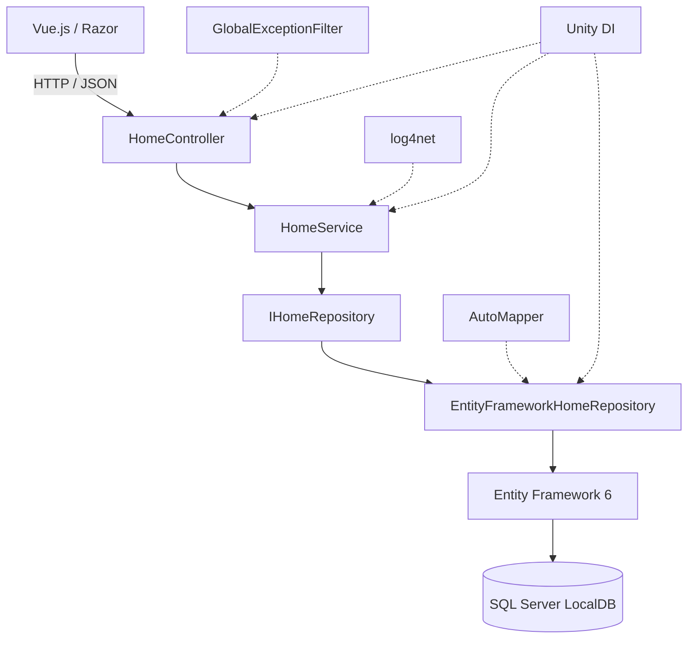
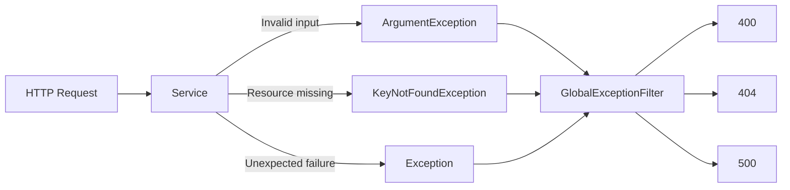
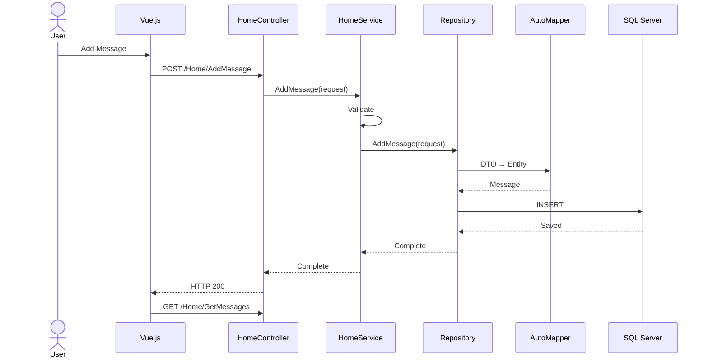
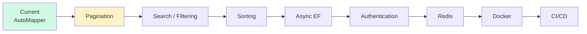

# 🚀 Dotnet Backend Study

> Evolving a simple ASP.NET MVC CRUD application into a structured and maintainable backend system.


A backend engineering study project built with **C#**, **ASP.NET MVC 5**, and **.NET Framework 4.8**.

The project started as a simple CRUD application and is being incrementally refactored to explore backend architecture, database persistence, dependency management, error handling, testing, and maintainability.

Rather than rebuilding the application for every new concept, each improvement is introduced into the existing system so that its architectural impact can be understood in practice.

---

## 🖥️ Demo

> Current application: persistent Message CRUD with Vue.js and ASP.NET MVC.

<!-- Add application screenshot here

<p align="center">
  
</p>

-->

The frontend communicates with ASP.NET MVC through the Fetch API, while message data is persisted through Entity Framework 6 and SQL Server LocalDB.

---

## ✨ Project at a Glance

| Category | Technology |
|---|---|
| **Language** | C# |
| **Framework** | ASP.NET MVC 5 · .NET Framework 4.8 |
| **Architecture** | Controller · Service · Repository |
| **Database** | SQL Server LocalDB |
| **ORM** | Entity Framework 6 |
| **Dependency Injection** | Unity |
| **Object Mapping** | AutoMapper |
| **Logging** | log4net |
| **Frontend** | Razor · Vue.js · Fetch API |
| **Testing** | MSTest |
| **Workflow** | GitHub Issues · Feature Branches · Pull Requests |

---

## 🏗️ Architecture



The application follows a layered structure in which HTTP handling, business logic, and data access are separated into different responsibilities.

```text
Presentation
     ↓
Controller
     ↓
Service
     ↓
Repository Abstraction
     ↓
Repository Implementation
     ↓
Persistence
```

---

## 🔥 Key Engineering Improvements

| Before | After |
|---|---|
| Controller handles most logic | Controller → Service → Repository |
| In-memory data | Entity Framework + SQL Server LocalDB |
| Concrete dependencies | Dependency Injection with Unity |
| Direct repository dependency | `IHomeRepository` abstraction |
| Manual DTO / Entity conversion | Centralized AutoMapper profiles |
| Repeated error handling | Global Exception Filter |
| No centralized logging | log4net |
| Manual verification | MSTest unit tests |
| No schema version history | EF Code First Migrations |

The focus of the project is therefore not simply adding features, but progressively improving **separation of concerns, testability, maintainability, and extensibility**.

---

## 📈 Architecture Evolution

```mermaid
flowchart LR
    A["Basic MVC CRUD"]
    --> B["Service Layer"]
    --> C["Repository"]
    --> D["Dependency Injection"]
    --> E["Unit Testing"]
    --> F["Logging"]
    --> G["Validation"]
    --> H["Entity Framework"]
    --> I["Migrations"]
    --> J["Global Exception Handling"]
    --> K["AutoMapper"]
    --> L["Pagination"]

    style K fill:#d1fae5
    style L fill:#fef3c7
```



**Current stage:** AutoMapper integration completed.  
**Next:** Server-side pagination.

Each stage is implemented incrementally so that the reason for introducing each architectural component remains visible in the repository history.

---

# 🛠️ Technical Details

## Layered Architecture

### Controller

The controller is responsible for the HTTP boundary.

It receives requests, delegates business operations to the service layer, and returns appropriate HTTP responses.

```text
HTTP Request
     ↓
Controller
     ↓
Service
```

Business rules and database operations are intentionally kept outside the controller.

### Service

The service layer contains application-level validation and business logic.

Examples include:

- Null request validation
- Empty message validation
- Coordinating repository operations
- Logging application events

```text
Controller
    ↓
HomeService
    ↓
IHomeRepository
```

### Repository

The repository layer encapsulates persistence logic.

```text
IHomeRepository
        ↓
EntityFrameworkHomeRepository
        ↓
Entity Framework
        ↓
SQL Server
```

The service depends on the interface rather than directly depending on Entity Framework.

This allows business logic to remain independent from the concrete persistence implementation.

---

## 💉 Dependency Injection

Unity is used to resolve application dependencies instead of manually constructing them inside application logic.

```text
HomeController
     ↓
HomeService

HomeService
     ↓
IHomeRepository

IHomeRepository
     ↓
EntityFrameworkHomeRepository

EntityFrameworkHomeRepository
     ↓
ApplicationDbContext
     ↓
IMapper
```

This reduces coupling between layers and improves testability.

---

## 🗄️ Persistence

The application uses **Entity Framework 6** with **SQL Server LocalDB**.

| Component | Responsibility |
|---|---|
| `ApplicationDbContext` | Entity Framework database context |
| `DbSet<Message>` | Message persistence |
| LINQ | Database querying |
| Code First | Schema generation from entities |
| EF Migrations | Schema version management |
| SQL Server LocalDB | Local development database |

Database schema changes are managed using migrations:

```powershell
Enable-Migrations
Add-Migration InitialCreate
Update-Database
```

This replaced the original in-memory message storage with persistent relational data.

---

## 🔄 DTO / Entity Mapping

Persistence entities are separated from request and response models.

| Source | Destination | Purpose |
|---|---|---|
| `CreateMessageRequest` | `Message` | Create entity |
| `UpdateMessageRequest` | `Message` | Update existing entity |
| `Message` | `MessageResponse` | Generate response DTO |

AutoMapper centralizes these transformations.

```text
CreateMessageRequest.Message
              ↓
      Message.MessageText


UpdateMessageRequest.Message
              ↓
      Message.MessageText


      Message.MessageText
              ↓
    MessageResponse.Message
```

This removes repetitive manual mapping logic from repository methods.

---

## ✅ Validation

Business validation is performed in the service layer before persistence operations are executed.

Current validation covers:

- Null requests
- Empty messages
- Invalid input
- Missing resources

Example:

```text
POST request
     ↓
HomeController
     ↓
HomeService
     ↓
Is Message empty?
     ↓
ArgumentException
```

Keeping validation in the service layer allows the same business rules to remain valid regardless of how the service is called.

---

## 🚨 Exception Handling

Application exceptions are translated into HTTP responses by a centralized MVC exception filter.

| Exception | HTTP Status |
|---|---|
| `ArgumentException` | `400 Bad Request` |
| `KeyNotFoundException` | `404 Not Found` |
| Unexpected Exception | `500 Internal Server Error` |



This prevents controller actions from containing duplicated exception-handling logic.

---

## 📝 Logging

Application logging is implemented using **log4net**.

The logging layer records important application events and failures without mixing infrastructure concerns with business logic.

Examples:

```text
Message created
Message updated
Message deleted
Validation warning
Unexpected application error
```

Logging configuration is separated into:

```text
log4net.config
```

---

# 🔄 Request Lifecycle

A message creation request currently travels through the application as follows:



The important point is that each layer has a limited responsibility rather than allowing HTTP, business logic, mapping, and database access to become mixed together.

---

# 🧪 Testing

The project uses **MSTest** to test service-layer behavior.

Tests currently cover scenarios such as:

- Successful message creation
- Empty message validation
- Null request validation
- Successful updates
- Successful deletion
- Invalid IDs
- Expected exception behavior

The service depends on:

```csharp
IHomeRepository
```

rather than:

```csharp
EntityFrameworkHomeRepository
```

which allows service behavior to be tested without requiring the real SQL Server database.

```text
Test
 ↓
HomeService
 ↓
Fake / Test Repository
```

This was one of the main reasons for introducing repository abstraction and dependency injection.

---

# 🔧 Development Workflow

Changes are developed through an issue-driven Git workflow.


Each architectural improvement is handled as an independent change rather than being introduced as one large rewrite.

```text
Issue
  ↓
Feature Branch
  ↓
Implementation
  ↓
Build
  ↓
Test
  ↓
Pull Request
  ↓
Merge
```

This also keeps the repository history useful for reviewing how the application evolved.

---

# 📊 Progress

### Application Architecture

- [x] ASP.NET MVC structure
- [x] Controller / Service separation
- [x] Repository Pattern
- [x] Repository abstraction
- [x] Dependency Injection

### Persistence

- [x] Entity Framework 6
- [x] SQL Server LocalDB
- [x] Code First
- [x] EF Migrations

### Maintainability

- [x] DTO separation
- [x] AutoMapper
- [x] Service-layer validation
- [x] Global Exception Handling
- [x] HTTP 400 / 404 / 500 mapping
- [x] log4net

### Testing

- [x] MSTest
- [x] Service unit tests
- [x] Validation tests
- [x] Exception tests

### Query Features

- [ ] Server-side Pagination
- [ ] Search / Filtering
- [ ] Sorting
- [ ] Async Entity Framework

### Security

- [ ] Authentication
- [ ] Authorization

### Infrastructure

- [ ] Redis
- [ ] Docker
- [ ] GitHub Actions
- [ ] Deployment

---

# 🗺️ Roadmap



### Phase 1 — Query Features

Server-side pagination  
→ Search and filtering  
→ Sorting  
→ Async database operations

### Phase 2 — Backend Reliability

Transaction handling  
→ Database indexing  
→ API response standardization  
→ Additional integration testing

### Phase 3 — Security

Authentication  
→ Authorization

### Phase 4 — Infrastructure

Redis caching  
→ Docker  
→ GitHub Actions  
→ Deployment

### Phase 5 — Modern .NET

After completing the .NET Framework version, the concepts learned here can be applied to:

```text
ASP.NET Core
     ↓
Modern Entity Framework
     ↓
PostgreSQL
     ↓
Modern .NET Backend Architecture
```

---

# 🎯 What This Project Is Teaching Me

The primary objective of this repository is to move beyond implementing CRUD operations and understand the engineering decisions surrounding them.

### Architecture

- Separation of concerns
- Layered architecture
- Repository abstraction
- Dependency Injection

### Data

- ORM-based persistence
- LINQ queries
- Database migrations
- DTO / Entity separation
- Object mapping

### Reliability

- Input validation
- Exception propagation
- HTTP status semantics
- Centralized logging

### Testability

- Interface-based dependencies
- Service-layer unit testing
- Testing failure scenarios

### Development Process

- Incremental refactoring
- Issue-driven development
- Feature branches
- Pull Requests
- Small architectural changes instead of large rewrites

---

# 💡 Project Philosophy

This project intentionally evolves from a small application rather than starting with a complex architecture.

```text
Simple CRUD
     ↓
Identify a limitation
     ↓
Introduce a solution
     ↓
Understand why it is needed
     ↓
Test the change
     ↓
Integrate it
     ↓
Repeat
```

For every new technology or pattern, the goal is to answer four questions:

> **Why is it needed?**  
> **What problem does it solve?**  
> **Where should it belong?**  
> **How does it affect the existing architecture?**

The repository therefore serves both as a working application and as a record of my progression toward building more maintainable backend systems.
