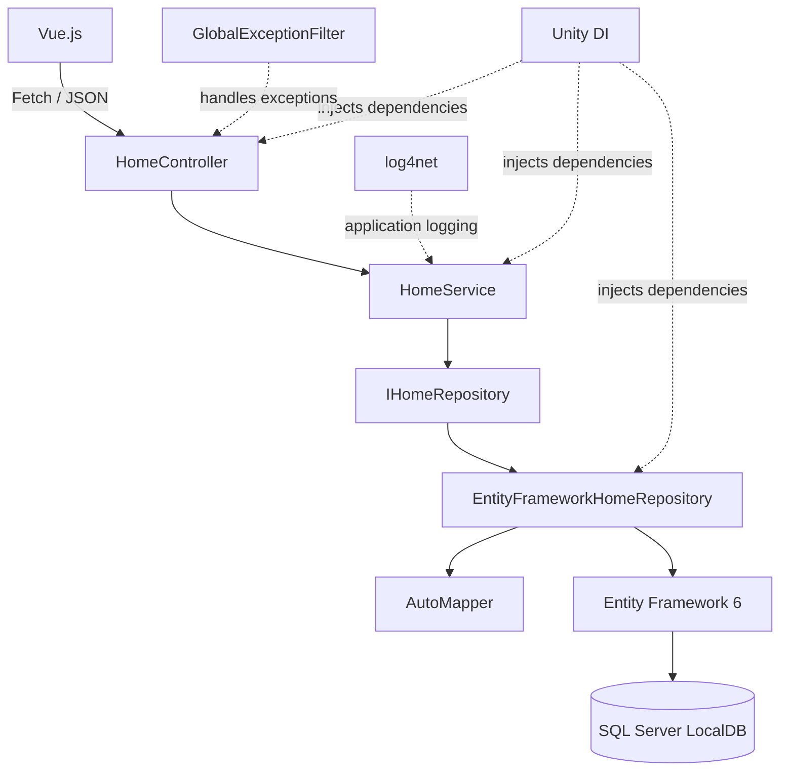
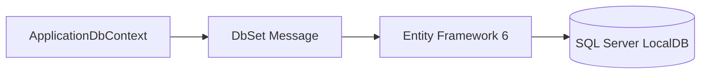
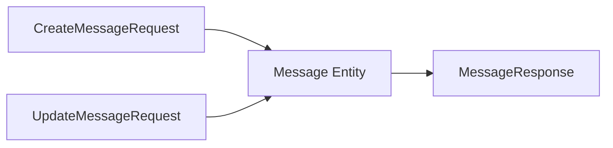
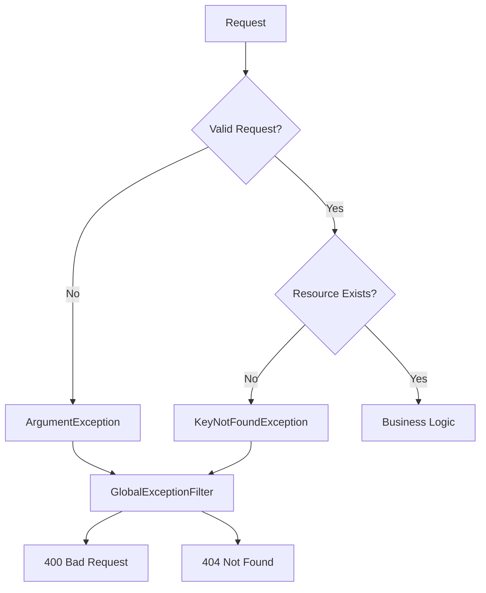
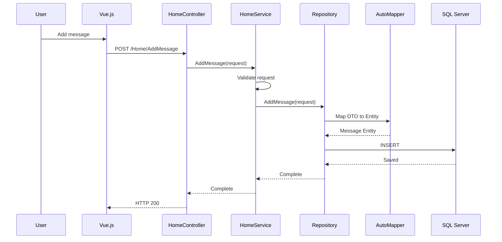
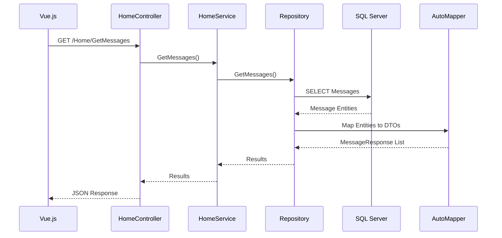
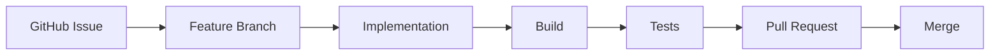
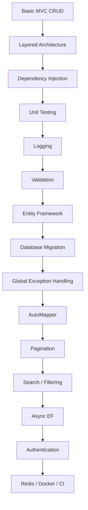

# 🚀 Dotnet Backend Study

> From a simple ASP.NET MVC CRUD application  
> to a structured backend architecture.


A backend engineering portfolio project built with **C#**, **ASP.NET MVC 5**, and **.NET Framework 4.8**.

This project started as a basic CRUD application and is being incrementally improved with patterns and technologies commonly used in real-world backend systems.

The main goal is not only to implement features, but to practice how backend applications are **structured, refactored, tested, debugged, and evolved over time**.

---

## ✨ Project at a Glance

| Category | Technology |
|---|---|
| **Language** | C# |
| **Framework** | ASP.NET MVC 5 · .NET Framework 4.8 |
| **Architecture** | Controller · Service · Repository |
| **Database** | SQL Server LocalDB |
| **ORM** | Entity Framework 6 |
| **Dependency Injection** | Unity |
| **Object Mapping** | AutoMapper |
| **Logging** | log4net |
| **Frontend** | Razor · Vue.js · Fetch API |
| **Testing** | MSTest |
| **Workflow** | GitHub Issues · Feature Branches · Pull Requests |

---

## 🏗️ Architecture



The application separates responsibilities into layers instead of placing business logic directly inside controllers.

---

## 🔥 Key Engineering Improvements

| Before | After |
|---|---|
| Controller handles most logic | Controller → Service → Repository |
| In-memory data | Entity Framework + SQL Server LocalDB |
| Concrete dependencies | Dependency Injection with Unity |
| Manual DTO / Entity mapping | AutoMapper |
| Repeated `try-catch` blocks | Global Exception Filter |
| No centralized logging | log4net |
| Manual verification only | MSTest unit tests |
| Direct implementation dependency | `IHomeRepository` abstraction |
| No database schema history | EF Code First Migrations |

---

## 📈 Architecture Evolution

```mermaid
flowchart LR
    A[Basic MVC CRUD]
    --> B[Service Layer]
    --> C[Repository Pattern]
    --> D[Dependency Injection]
    --> E[Unit Testing]
    --> F[Logging]
    --> G[Validation]
    --> H[Entity Framework]
    --> I[Code First Migration]
    --> J[Global Exception Handling]
    --> K[AutoMapper]
    --> L[Pagination]

    style K fill:#d1fae5
    style L fill:#fef3c7
```



The repository intentionally keeps the implementation history visible so that each step represents a separate backend concept and refactoring decision.

---

## 🛠️ Tech Stack

### Backend

- C#
- .NET Framework 4.8
- ASP.NET MVC 5
- Entity Framework 6
- Unity
- AutoMapper
- log4net

### Database

- SQL Server LocalDB
- Entity Framework Code First
- EF Migrations

### Frontend

- Razor View
- Vue.js
- Fetch API
- JSON-based client/server communication

### Testing & Development

- MSTest
- Git
- GitHub Issues
- Feature Branch Workflow
- Pull Requests
- Visual Studio

---

## ✨ Implemented Features

### Message CRUD

The application currently supports:

- Create messages
- Read messages
- Update messages
- Delete messages

### Layered Architecture

Responsibilities are separated into:

```text
Controller
    ↓
Service
    ↓
Repository Interface
    ↓
Repository Implementation
    ↓
Database
```

### Dependency Injection

Unity is used to resolve dependencies instead of manually creating objects inside application logic.

Examples:

```text
IHomeRepository
      ↓
EntityFrameworkHomeRepository

ApplicationDbContext
      ↓
Injected into Repository

IMapper
      ↓
Injected into Repository
```

---

## 🗄️ Entity Framework & Database

The application uses **Entity Framework 6** for database persistence.



Entity Framework is currently used for:

- `DbContext`
- `DbSet`
- LINQ queries
- Code First
- Migrations
- CRUD persistence

Database schema changes are managed through EF migrations.

```powershell
Enable-Migrations
Add-Migration InitialCreate
Update-Database
```

---

## 🔄 DTO / Entity Mapping

Request and response DTOs are separated from persistence entities.



AutoMapper centralizes object mapping rules.

Example mappings:

```text
CreateMessageRequest.Message
          ↓
Message.MessageText

UpdateMessageRequest.Message
          ↓
Message.MessageText

Message.MessageText
          ↓
MessageResponse.Message
```

This removes repeated manual mapping code from the repository layer.

---

## ✅ Validation

Business validation is handled in the service layer.

Example:

```text
Empty Message
     ↓
HomeService
     ↓
ArgumentException
     ↓
GlobalExceptionFilter
     ↓
400 Bad Request
```

Current validation includes:

- Null request validation
- Empty message validation
- Invalid input handling
- Missing resource handling

---

## 🚨 Global Exception Handling

Exceptions are handled centrally through an ASP.NET MVC exception filter.

| Exception | HTTP Response |
|---|---|
| `ArgumentException` | `400 Bad Request` |
| `KeyNotFoundException` | `404 Not Found` |
| Unexpected Exception | `500 Internal Server Error` |



This avoids duplicated `try-catch` blocks inside individual controller actions.

---

## 📝 Logging

Application logging is implemented with **log4net**.

Examples of logged events:

```text
Message created
Message updated
Message deleted
Validation warning
Unexpected application error
```

Logging configuration is isolated in:

```text
log4net.config
```

This keeps logging configuration separated from application code.

---

## 🔄 Request Flow

### Create Message



### Read Messages



---

## 🧪 Testing

The project uses **MSTest** to verify service behavior independently from the real database.

Current tests cover areas such as:

- Successful message creation
- Empty message validation
- Null request validation
- Update behavior
- Delete behavior
- Invalid IDs
- Exception behavior

The service layer can be tested without a real database because it depends on:

```text
IHomeRepository
```

instead of a concrete Entity Framework repository implementation.

---

## 🔧 Development Workflow

Features are implemented using an issue-driven Git workflow.



Each major backend concept is implemented as an independent issue.

This makes the repository not only a source code project, but also a record of the application's architectural evolution.

---

## 📊 Current Progress

- [x] MVC structure
- [x] Controller / Service separation
- [x] Repository Pattern
- [x] Repository abstraction
- [x] Dependency Injection
- [x] Unit testing
- [x] log4net logging
- [x] Service-layer validation
- [x] Entity Framework 6
- [x] SQL Server LocalDB
- [x] Code First Migration
- [x] Global Exception Handling
- [x] HTTP 400 / 404 / 500 mapping
- [x] AutoMapper
- [ ] Server-side Pagination
- [ ] Search / Filtering
- [ ] Sorting
- [ ] Async Entity Framework
- [ ] Authentication
- [ ] Authorization
- [ ] Redis
- [ ] Docker
- [ ] GitHub Actions CI/CD

---

## 🗺️ Roadmap

### Near Term

- Server-side pagination
- Search and filtering
- Sorting
- Async database operations

### Backend Improvements

- Authentication
- Authorization
- Transaction handling
- Database indexing
- API response standardization

### Infrastructure

- Redis caching
- Docker
- GitHub Actions
- Deployment

### Next Generation

- ASP.NET Core
- PostgreSQL
- Modern .NET backend architecture
- Clean Architecture
- CQRS fundamentals

---

## 🎯 Engineering Goals

This repository is being used to practice backend engineering concepts beyond basic CRUD implementation.

Key areas include:

- Separation of concerns
- Layered architecture
- Dependency Injection
- Repository abstraction
- ORM design
- Database persistence
- Database migrations
- DTO design
- Object mapping
- Exception propagation
- HTTP status codes
- Logging
- Unit testing
- Client/server communication
- Incremental refactoring
- Git-based engineering workflow

---

## 🧭 Current Stage



**Current focus:** server-side pagination and query-oriented backend features.

---

## 📌 Project Philosophy

Rather than rebuilding the application from scratch whenever a new concept is learned, this project evolves incrementally.

Each feature introduces a new backend concern while preserving previous functionality.

The objective is to understand not only **how to implement a technology**, but also:

> Why is it needed?  
> Where should it belong?  
> What problem does it solve?  
> How does it affect the existing architecture?

This repository documents that progression.
