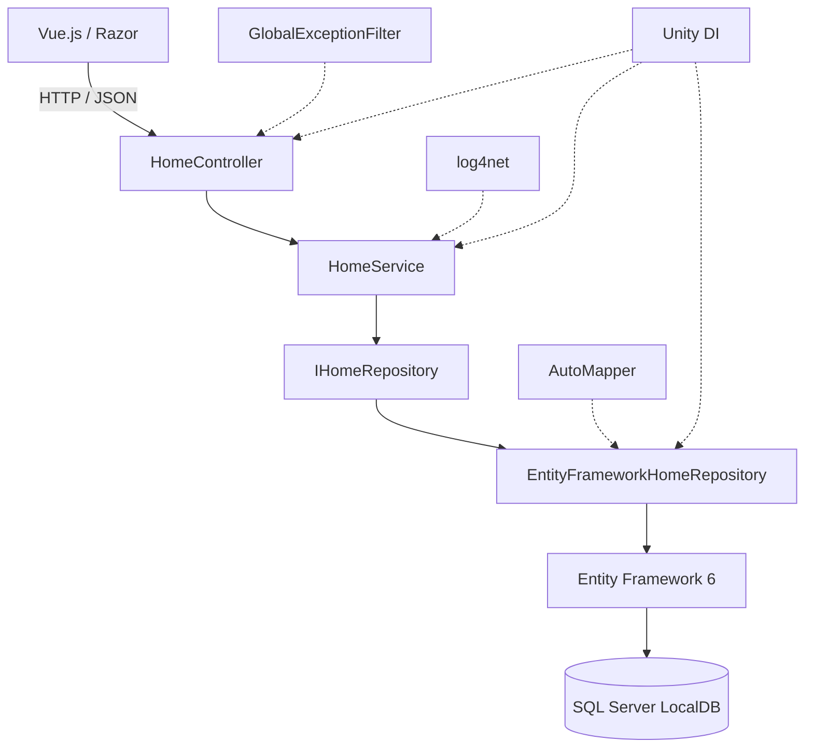
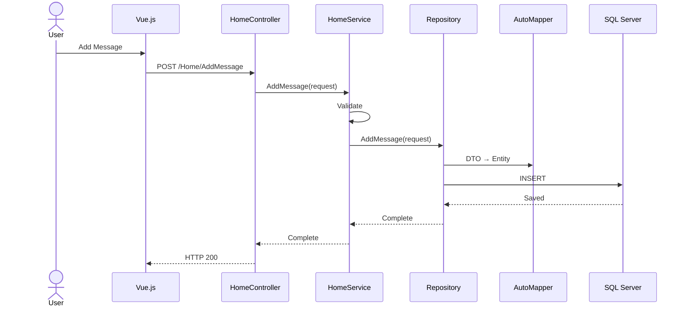
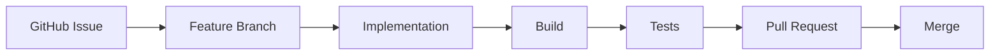
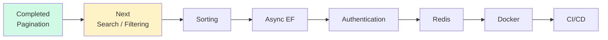

# 🚀 Dotnet Backend Study

**English** | [日本語](README.ja.md)

> Evolving a simple ASP.NET MVC CRUD application into a structured and maintainable backend system.


A backend engineering study project built with **C#**, **ASP.NET MVC 5**, and **.NET Framework 4.8**.

The project started as a simple CRUD application and is being incrementally refactored to explore backend architecture, persistence, dependency management, validation, testing, and maintainability. Each improvement is introduced into the existing system so its architectural impact stays visible in the repository history.

---

## 🖥️ Demo

> Current application: persistent Message CRUD with server-side pagination, Vue.js, and ASP.NET MVC.

<!-- Add application screenshot here

<p align="center">
  
</p>

-->

The frontend communicates with ASP.NET MVC through the Fetch API, while message data is persisted through Entity Framework 6 and SQL Server LocalDB.

---

## ✨ Project at a Glance

| Category | Technology |
|---|---|
| **Language** | C# |
| **Framework** | ASP.NET MVC 5 · .NET Framework 4.8 |
| **Architecture** | Controller · Service · Repository |
| **Database** | SQL Server LocalDB |
| **ORM** | Entity Framework 6 |
| **Dependency Injection** | Unity |
| **Object Mapping** | AutoMapper |
| **Logging** | log4net |
| **Frontend** | Razor · Vue.js · Fetch API |
| **Testing** | MSTest |
| **Workflow** | GitHub Issues · Feature Branches · Pull Requests |

---

## 🏗️ Architecture



Responsibilities are separated by layer:

| Layer | Responsibility |
|---|---|
| **Controller** | HTTP boundary, request/response handling |
| **Service** | Validation and application logic |
| **Repository** | Persistence abstraction and database queries |
| **Entity Framework** | ORM and SQL Server access |

The service depends on `IHomeRepository`, not the concrete Entity Framework repository, keeping business logic testable and independent from persistence details.

---

## 🔥 Key Engineering Improvements

| Before | After |
|---|---|
| Controller handles most logic | Controller → Service → Repository |
| In-memory data | Entity Framework + SQL Server LocalDB |
| Concrete dependencies | Dependency Injection with Unity |
| Direct repository dependency | `IHomeRepository` abstraction |
| Manual DTO / Entity conversion | Centralized AutoMapper profiles |
| Repeated error handling | Global Exception Filter |
| No centralized logging | log4net |
| Manual verification | MSTest unit tests |
| No schema version history | EF Code First Migrations |
| Load every record | Server-side pagination with `Skip` / `Take` |

The goal is not simply adding features, but improving **separation of concerns, testability, maintainability, and extensibility** step by step.

### Performance Case Study

- [TIFF-to-PDF Conversion: From Test Data Generation to Performance Optimization](docs/tiff-to-pdf-performance.md)  
  Built a multi-page TIFF test-data generator, selected libraries under licensing constraints, removed repeated disk I/O, corrected stream lifetime management, and improved conversion performance by approximately **4–4.7×**.

---

## 📈 Architecture Evolution

```mermaid
flowchart LR
    A["Basic MVC CRUD"]
    --> B["Service Layer"]
    --> C["Repository"]
    --> D["Dependency Injection"]
    --> E["Unit Testing"]
    --> F["Logging"]
    --> G["Validation"]
    --> H["Entity Framework"]
    --> I["Migrations"]
    --> J["Global Exception Handling"]
    --> K["AutoMapper"]
    --> L["Pagination"]
    --> M["Search / Filtering"]

    style K fill:#d1fae5
    style L fill:#d1fae5
    style M fill:#fef3c7
```



**Current stage:** Server-side pagination completed.  
**Next:** Search / Filtering.

---

# 🛠️ Technical Details

## 💉 Dependency Injection

Unity resolves the main dependency chain:

```text
HomeController
     ↓
HomeService
     ↓
IHomeRepository
     ↓
EntityFrameworkHomeRepository
     ↓
ApplicationDbContext
```

This reduces coupling and makes service behavior testable without a real database.

---

## 🗄️ Persistence

The application uses **Entity Framework 6** with **SQL Server LocalDB**.

| Component | Responsibility |
|---|---|
| `ApplicationDbContext` | Entity Framework database context |
| `DbSet<Message>` | Message persistence |
| LINQ | Database querying |
| Code First | Schema generation from entities |
| EF Migrations | Schema version management |
| SQL Server LocalDB | Local development database |

Schema changes are managed with Entity Framework migrations rather than rebuilding the database manually.

---

## 🔄 DTO / Entity Mapping

Persistence entities are separated from request and response models. AutoMapper centralizes transformations such as:

```text
CreateMessageRequest → Message
UpdateMessageRequest → Message
Message              → MessageResponse
```

This keeps mapping logic out of repository methods and avoids repetitive property assignment.

---

## 📄 Server-side Pagination

Message retrieval is paginated on the server instead of loading the full table into memory.

```text
Client requests page + pageSize
          ↓
Controller validates request boundary
          ↓
Service delegates query
          ↓
Repository counts matching rows
          ↓
OrderBy → Skip → Take
          ↓
Items + pagination metadata
          ↓
Vue renders the requested page
```

The repository uses LINQ pagination with `Skip` / `Take`, while the response carries the information the client needs to navigate pages.

Pagination behavior includes:

- `Skip` / `Take` database queries
- Total record count
- Pagination metadata such as current page, page size, and total pages
- Boundary validation for invalid paging parameters
- Empty-page handling without treating an empty result as an application failure
- Frontend reload after create/delete so page state reflects the latest data

This keeps data retrieval bounded and provides a foundation for the next query features: **search, filtering, and sorting**.

---

## ✅ Validation & Exception Handling

Business validation is performed before persistence operations. Current cases include null requests, empty messages, invalid paging input, invalid IDs, and missing resources.

Application exceptions are translated into HTTP responses by a centralized MVC exception filter:

| Exception | HTTP Status |
|---|---|
| `ArgumentException` | `400 Bad Request` |
| `KeyNotFoundException` | `404 Not Found` |
| Unexpected Exception | `500 Internal Server Error` |

This prevents controller actions from duplicating exception-handling logic.

---

## 📝 Logging

**log4net** records important application events and failures while keeping infrastructure concerns separate from business logic.

Examples include message creation/update/deletion, validation warnings, and unexpected application errors.

---

# 🔄 Request Lifecycle

A typical write request follows the same layered path:



Each layer has a limited responsibility rather than mixing HTTP handling, business rules, mapping, and database access.

---

# 🧪 Testing

The project uses **MSTest** primarily for service-layer behavior.

Coverage includes:

- Successful create/update/delete flows
- Empty and null request validation
- Invalid IDs and expected exceptions
- Pagination success cases
- Invalid pagination parameters
- Empty-page and boundary scenarios

Because the service depends on `IHomeRepository`, tests can replace persistence with a fake/test repository instead of requiring SQL Server.

---

# 🔧 Development Workflow

Changes follow an issue-driven workflow:



Each architectural improvement is kept small enough to review independently, preserving the repository history as a record of how the application evolved.

---

# 📊 Progress

### Application Architecture

- [x] ASP.NET MVC structure
- [x] Controller / Service separation
- [x] Repository Pattern
- [x] Repository abstraction
- [x] Dependency Injection

### Persistence

- [x] Entity Framework 6
- [x] SQL Server LocalDB
- [x] Code First
- [x] EF Migrations

### Maintainability

- [x] DTO separation
- [x] AutoMapper
- [x] Service-layer validation
- [x] Global Exception Handling
- [x] HTTP 400 / 404 / 500 mapping
- [x] log4net

### Testing

- [x] MSTest
- [x] Service unit tests
- [x] Validation tests
- [x] Exception tests
- [x] Pagination boundary tests

### Query Features

- [x] Server-side Pagination
- [ ] Search / Filtering
- [ ] Sorting
- [ ] Async Entity Framework

### Security

- [ ] Authentication
- [ ] Authorization

### Infrastructure

- [ ] Redis
- [ ] Docker
- [ ] GitHub Actions
- [ ] Deployment

---

# 🗺️ Roadmap



### Phase 1 — Query Features

Search and filtering  
→ Sorting  
→ Async database operations

### Phase 2 — Backend Reliability

Transaction handling  
→ Database indexing  
→ API response standardization  
→ Additional integration testing

### Phase 3 — Security

Authentication  
→ Authorization

### Phase 4 — Infrastructure

Redis caching  
→ Docker  
→ GitHub Actions  
→ Deployment

### Phase 5 — Modern .NET

After completing the .NET Framework version, the concepts learned here can be applied to a modern stack such as **ASP.NET Core**, modern Entity Framework, and PostgreSQL.

---

# 🎯 What This Project Is Teaching Me

The repository is a practical record of moving beyond CRUD toward maintainable backend engineering:

- **Architecture:** separation of concerns, layered design, repository abstraction, dependency injection
- **Data:** ORM persistence, LINQ, migrations, DTO/entity separation, object mapping, paginated queries
- **Reliability:** validation, exception propagation, HTTP semantics, centralized logging
- **Testability:** interface-based dependencies, service unit tests, failure and boundary scenarios
- **Process:** incremental refactoring, issues, feature branches, pull requests, and small reviewable changes

The core loop is simple:

```text
Identify a limitation
        ↓
Introduce a focused solution
        ↓
Understand its architectural impact
        ↓
Test and integrate it
        ↓
Repeat
```
